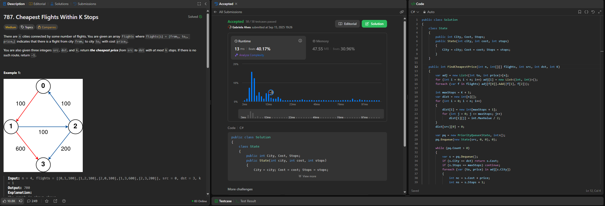
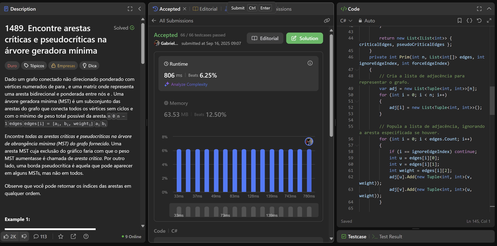

# LeetCodeQuestions - GRAFOS 2

**Conteúdo da Disciplina**: Grafos 2<br>

## Alunos

| Matrícula  | Aluno                |
| ---------- | -------------------- |
| 21/1031673 | Cauã Matheus         |
| 21/1030756 | Gabriela Silva Alves |

## Sobre

Este repositório apresenta soluções para quatro problemas do LeetCode, organizadas por linguagem e nível de dificuldade:

### C++
- [743. Network Delay Time](https://leetcode.com/problems/network-delay-time/description/) **(Medium)**

- [3600. Maximize Spanning Tree Stability with Upgrades](https://leetcode.com/problems/maximize-spanning-tree-stability-with-upgrades/description/) **(Hard)**

---

### C\#
- [787. Cheapest Flights Within K Stops](https://leetcode.com/problems/cheapest-flights-within-k-stops/description/?envType=problem-list-v2&envId=9id5lube) **(Medium)**

- [1489. Find Critical and Pseudo-Critical Edges in Minimum Spanning Tree](https://leetcode.com/problems/find-critical-and-pseudo-critical-edges-in-minimum-spanning-tree/description/?envType=problem-list-v2&envId=minimum-spanning-tree) **(Hard)**
## Screenshots

### Visualização 

#### C\#
- Cheapest Flights Within K Stops


- Cheapest Flights Within K Stops


---

## Instalação

**Linguagem**: C++ e C# <br>

**Pré-requisitos:**

- .NET SDK: versão 10
- Ferramentas de linha de comando: git, bash (ou terminal equivalente)

## Passo a passo

### 1. Clone o repositório

### 2. Compilar e executar C++

### 3. Compilar e executar soluções C#

Os comandos a seguir devem ser executados a partir da raiz do repositório clonado.
> OBS.: Para submssão em juízes como leetcode, submeter apenas classe Solution.

#### Executando as Soluções

#### **Questão 787. Cheapest Flights Within K Stops**

Para compilar e executar a validação desta questão, utilize o comando:

```bash
dotnet run --project Solutions/csharp/CheapestFlights
```

#### **Questão 1489. Find Critical and Pseudo-Critical Edges in Minimum Spanning Tree**

Para compilar e executar a validação desta questão, utilize o comando:

```bash
dotnet run --project Solutions/csharp/FindCritical
```

## Apresentação

Vídeo disponível em: [Apresentação D16](https://youtu.be/ZISNHHjXy4w)

## Outros

Para dúvidas, sugestões ou melhorias, entre em contato com os autores.


